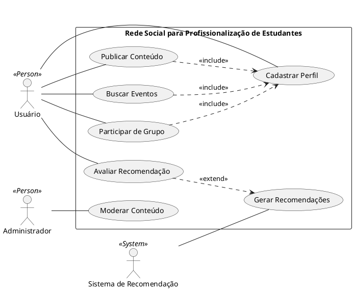

## Diagram de Casos de Uso

# Especificação de Caso de Uso - UC001 - Cadastrar Perfil

## Código / Nome do Caso de Uso

| Código / Nome do Caso de Uso | UC001 - Cadastrar Perfil |
|-----------------------------|--------------------------|
| **Ator Principal**           | Usuário                  |
| **Resumo**                   | O usuário cria seu perfil fornecendo informações pessoais, acadêmicas e profissionais. O sistema usará esses dados para personalizar as recomendações de cursos, grupos de bate-papo e eventos. |
| **Pré-condições**            | O usuário deve estar na tela inicial do aplicativo. O usuário não pode estar logado anteriormente no sistema. |
| **Pós-condições**            | O perfil do usuário é criado e armazenado no banco de dados, permitindo que o usuário tenha acesso à funcionalidade de recomendações. |

---

## Fluxo Principal

| **Usuário** | **Sistema** |
|-------------|-------------|
| 1. O usuário acessa a tela de cadastro. | |
| | 2. O sistema exibe o formulário de cadastro. | |
| 3. O usuário preenche informações pessoais e profissionais. | |
| | 4. O sistema valida os dados e confirma o preenchimento adequado. | |
| | 5. O sistema armazena os dados no banco de dados e cria o perfil do usuário. | |
| | 6. O sistema direciona o usuário para a tela inicial, com recomendações de cursos e grupos. | |

---

## Especificação de Caso de Uso - UC002 - Publicar Conteúdo

### Código / Nome do Caso de Uso

| Código / Nome do Caso de Uso | UC002 - Publicar Conteúdo |
|-----------------------------|--------------------------|
| **Ator Principal**           | Usuário                  |
| **Resumo**                   | O usuário pode publicar postagens sobre cursos que está realizando ou já realizou, além de compartilhar experiências e insights com outros usuários. |
| **Pré-condições**            | O usuário deve estar logado no sistema. |
| **Pós-condições**            | A publicação é salva no banco de dados e aparece no feed do usuário e dos demais usuários que o seguem ou possuem interesses semelhantes. |

---

## Fluxo Principal

| **Usuário** | **Sistema** |
|-------------|-------------|
| 1. O usuário acessa a tela de criação de publicação. | |
|| 2. O sistema exibe o campo para criação de texto e upload de mídia (imagens, vídeos). | |
| 3. O usuário insere o texto e os dados do curso/evento. | |
| 4. O usuário publica o conteúdo. | |
|| 5. O sistema armazena o conteúdo e exibe a publicação no feed do usuário e no feed de outros usuários com interesses semelhantes. | |

---

## Especificação de Caso de Uso - UC003 - Buscar Eventos

### Código / Nome do Caso de Uso

| Código / Nome do Caso de Uso | UC003 - Buscar Eventos |
|-----------------------------|------------------------|
| **Ator Principal**           | Usuário                |
| **Resumo**                   | O usuário pode buscar eventos, como palestras e workshops, relacionados à sua área de interesse, para promover seu desenvolvimento profissional. |
| **Pré-condições**            | O usuário deve estar logado no sistema. |
| **Pós-condições**            | O usuário encontra eventos relevantes e pode se inscrever para participação. |

---

## Fluxo Principal

| **Usuário** | **Sistema** |
|-------------|-------------|
| 1. O usuário acessa a tela de eventos. | |
|| 2. O sistema exibe a lista de eventos disponíveis, de acordo com o perfil do usuário. | |
| 3. O usuário seleciona um evento para mais informações. | |
|| 4. O sistema exibe detalhes do evento. | |
| 5. O usuário se inscreve no evento. | |
|| 6. O sistema confirma a inscrição do usuário e exibe um aviso de sucesso. | |

---

## Especificação de Caso de Uso - UC004 - Participar de Grupo

### Código / Nome do Caso de Uso

| Código / Nome do Caso de Uso | UC004 - Participar de Grupo |
|-----------------------------|----------------------------|
| **Ator Principal**           | Usuário                    |
| **Resumo**                   | O usuário pode se inscrever em grupos de bate-papo relacionados ao seu campo de interesse profissional para troca de conhecimentos e experiências. |
| **Pré-condições**            | O usuário deve estar logado no sistema. |
| **Pós-condições**            | O usuário se torna membro do grupo de bate-papo escolhido. |

---

## Fluxo Principal

| **Usuário** | **Sistema** |
|-------------|-------------|
| 1. O usuário acessa a lista de grupos disponíveis. | |
|| 2. O sistema exibe grupos baseados nas preferências do usuário. | |
| 3. O usuário escolhe um grupo para participar. | |
|| 4. O sistema adiciona o usuário ao grupo de bate-papo. | |
|| 5. O sistema confirma a adesão ao grupo e exibe a tela do grupo. | |

---

## Especificação de Caso de Uso - UC005 - Avaliar Recomendação

### Código / Nome do Caso de Uso

| Código / Nome do Caso de Uso | UC005 - Avaliar Recomendação |
|-----------------------------|----------------------------|
| **Ator Principal**           | Usuário                    |
| **Resumo**                   | O usuário pode avaliar as recomendações de cursos, eventos ou grupos, informando se foram úteis ou não. Isso ajuda a melhorar as futuras recomendações do sistema. |
| **Pré-condições**            | O usuário deve estar logado no sistema e ter recebido recomendações. |
| **Pós-condições**            | O sistema atualiza a avaliação da recomendação, melhorando as futuras sugestões. |

---

## Fluxo Principal

| **Usuário** | **Sistema** |
|-------------|-------------|
| 1. O usuário visualiza uma recomendação de curso/evento/grupo. | |
|| 2. O sistema exibe a opção de avaliação (útil/não útil). | |
| 3. O usuário seleciona a avaliação. | |
|| 4. O sistema armazena a avaliação e ajusta a personalização de futuras recomendações. | |

---

## Especificação de Caso de Uso - UC006 - Moderar Conteúdo

### Código / Nome do Caso de Uso

| Código / Nome do Caso de Uso | UC006 - Moderar Conteúdo |
|-----------------------------|-------------------------|
| **Ator Principal**           | Administrador            |
| **Resumo**                   | O administrador é responsável por moderar o conteúdo postado pelos usuários, garantindo que ele esteja de acordo com as regras e diretrizes da plataforma. |
| **Pré-condições**            | O administrador deve estar logado no sistema. |
| **Pós-condições**            | O conteúdo foi aprovado ou removido do sistema. |

---

## Fluxo Principal

| **Administrador** | **Sistema** |
|------------------|-------------|
| 1. O administrador acessa a tela de moderação. | |
|| 2. O sistema exibe as postagens pendentes de moderação. | |
| 3. O administrador revisa o conteúdo. | |
| 4. O administrador aprova ou remove o conteúdo. | |
|| 5. O sistema atualiza o status da postagem. | |

---

## Especificação de Caso de Uso - UC007 - Gerar Recomendações

### Código / Nome do Caso de Uso

| Código / Nome do Caso de Uso | UC007 - Gerar Recomendações |
|-----------------------------|----------------------------|
| **Ator Principal**           | Sistema de Recomendação    |
| **Resumo**                   | O sistema de recomendação gera cursos, eventos e grupos baseados no perfil e interesses do usuário, com o objetivo de apoiar seu desenvolvimento profissional. |
| **Pré-condições**            | O usuário deve ter um perfil preenchido e ter interagido com o sistema. |
| **Pós-condições**            | O usuário recebe recomendações personalizadas. |

---

## Fluxo Principal

| **Sistema** | **Usuário** |
|-------------|-------------|
| 1. O sistema coleta dados do perfil do usuário. | |
| 2. O sistema analisa os dados e gera recomendações de cursos, eventos e grupos. | |
| 3. O sistema envia as recomendações para o feed do usuário. | |

---